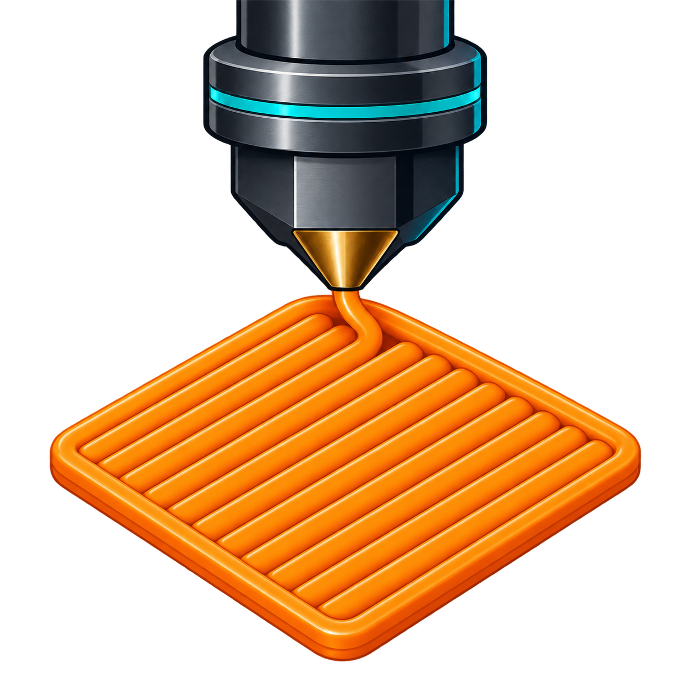

<p align="center">
  
</p>

# First Layer Squish for Klipper

An interactive Klipper calibration that prints first-layer patches one at a
time. After each patch, either accept the result or adjust Z from Mainsail,
Fluidd, KlipperScreen, the console, or an optional physical LCD menu and print
another patch. The default maximum is nine 20 mm (2 cm) squares distributed in
a 3x3 grid, with four layers per square.

The workflow is based on [Ellis' First Layer Squish guide](https://ellis3dp.com/Print-Tuning-Guide/articles/first_layer_squish.html):
use a reasonably thick first layer, a line width of at least 120% of nozzle
diameter, and inspect solid patches while adjusting Z live.

## Current scope

- Cartesian and CoreXY printers
- Probe/virtual-endstop and dedicated Z-endstop configurations
- Interactive free adjustment rather than a predetermined offset series
- Rectangular perimeters with configurable diagonal solid infill (45° default)
- Configurable 3-20 layer patches (four layers by default), with alternating
  solid-infill direction between layers
- Configurable temperatures, geometry, extrusion, speeds, and start/end G-code
- A substantial two-pass purge/wipe strip before every patch, preventing pause
  ooze from contaminating the calibration surface
- Named PLA, TPU, and ABS temperature profiles selected from the start command
- Mainsail, Fluidd, and KlipperScreen macro controls
- Native manual-probe dialog integration in Mainsail and Fluidd, with automatic
  Z-calibration panel activation in KlipperScreen
- Optional physical LCD menu
- Remembers the adjustment used for every printed square
- Stages the result with `Z_OFFSET_APPLY_PROBE` or
  `Z_OFFSET_APPLY_ENDSTOP`; the user decides when to run `SAVE_CONFIG`

## Installation

Clone this repository beside your other Klipper add-ons and run:

```bash
./scripts/install.sh
```

Alternatively, symlink `klippy/extras/first_layer_squish.py` into
`~/klipper/klippy/extras/first_layer_squish.py`.

Copy `config/first_layer_squish.cfg` into the printer configuration directory,
customize its `start_gcode`, and add this to `printer.cfg`:

```ini
[include first_layer_squish.cfg]
```

For a physical LCD, also copy and include
`config/first_layer_squish_menu.cfg`.

Because this add-on installs Python code, restart the **Klipper system service**
after installing or updating it:

```bash
sudo systemctl restart klipper
```

`RESTART` and `FIRMWARE_RESTART` reload printer configuration inside the
existing Python process and may continue using an already-imported version of
the add-on.

The example start G-code heats and homes the printer. Most CoreXY machines
should customize it to call their normal gantry-leveling, probe-docking, mesh,
and heat-soak routines. Calibration refuses to begin unless XYZ are homed when
the start G-code finishes.

## Usage

1. Clean the build surface and run `FIRST_LAYER_SQUISH FILAMENT=PLA` (or TPU
   or ABS).
2. Inspect the first patch.
3. The normal manual-probe UI opens. Use its negative Z buttons for more squish
   or positive Z buttons for less squish.
4. To try another offset, adjust Z and press **Accept**. This prints the next
   patch using the new setting.
5. When a printed patch looks good, leave Z unchanged and press **Accept**.
   The plugin stages that offset in Klipper's pending configuration without
   running `SAVE_CONFIG` or restarting Klipper; you do not have to print all
   nine patches.
6. If an earlier patch was best, run `SQUISH_SELECT SQUARE=6` (for example),
   then press **Accept**.
7. The same native commands can be entered in the console while calibration is
   active: `TESTZ Z=-0.01`, `ACCEPT`, `NEXT`, and `ABORT`. `NEXT` forces
   another patch even when Z has not changed.

After accepting a result, review the reported pending offset and run
`SAVE_CONFIG` manually when ready. Klipper writes the pending change and
restarts only when you issue that command. If Klipper is restarted before
`SAVE_CONFIG`, the staged configuration change is discarded.

After each patch the nozzle retracts, lifts, and travels to the next patch's
start position so the completed surface is unobstructed. After the final patch
it parks at the front of the bed.

Before every patch, including the first, the nozzle prints a separate two-pass
40 mm purge/wipe strip beside the upcoming square. It then retracts and drags
the nozzle 5 mm back over the fresh strip before lifting. This removes material
that oozed during the interactive pause and restores nozzle pressure before the
calibration surface begins. Configure it with `wipe_line_length`,
`wipe_line_count`, `wipe_line_spacing`, `wipe_line_gap`, and
`wipe_tail_length`; set `wipe_line_length: 0` to disable it. Individual runs
may override these values with `WIPE_LENGTH`, `WIPE_LINES`, `WIPE_SPACING`,
`WIPE_GAP`, and `WIPE_TAIL`.

The manual-probe dialog is supplied by the frontend, not by Klicky itself.
Klicky activates Klipper's built-in `manual_probe` state; this plugin publishes
the same state and implements the same `TESTZ`, `ACCEPT`, and `ABORT` commands.
If the dialog does not open automatically, check the manual-probe dialog setting
in Mainsail or Fluidd.

Run `ABORT` at any time to restore the original live offset. The default
maximum adjustment in either direction is 0.5 mm.

Start-time overrides are supported, for example:

```gcode
FIRST_LAYER_SQUISH FILAMENT=ABS SIZE=20 LAYERS=4 FLOW=0.98 INFILL_ANGLE=45
```

The supplied material sections contain starting temperatures:

| Profile | Hotend | Bed |
| --- | ---: | ---: |
| PLA | 210 °C | 60 °C |
| TPU | 225 °C | 50 °C |
| ABS | 250 °C | 110 °C |

The `FILAMENT` parameter is required. Select a profile with `FILAMENT=PLA`,
`FILAMENT=TPU`, or `FILAMENT=ABS`; profile names are case-insensitive.
Individual runs may override `HOTEND_TEMP` or `BED_TEMP`.

Negative Z adjustment means more squish, matching Klipper's
`SET_GCODE_OFFSET Z_ADJUST=...` convention.

## Moonraker update manager

After choosing a permanent checkout path, this optional Moonraker section lets
the repository update with the rest of the printer software:

```ini
[update_manager first-layer-squish]
type: git_repo
path: ~/first-layer-squish-klipper-calibration
origin: https://github.com/YOUR_ACCOUNT/first-layer-squish-klipper-calibration.git
primary_branch: main
managed_services: klipper
```

## Development

The geometry and extrusion tests use Python's standard test runner:

```bash
python -m unittest discover -s tests -v
```

## Safety

Watch the first run closely and keep emergency-stop access available. Verify
bed bounds, temperatures, start G-code, and Z direction before allowing the
printer to continue through all nine patches.
